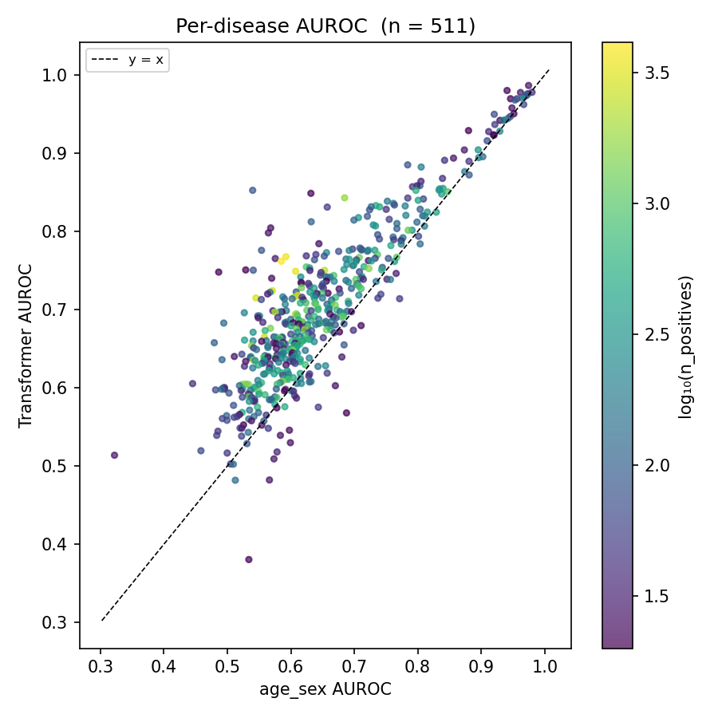

# Next-diagnosis prediction on a synthetic cohort

**Headline.** The transformer predicts the next recorded diagnosis better than a tuned age and sex baseline, on most diseases and with higher mean AUROC in every sex and age stratum. Shuffling the history removes all of its NLL advantage and about a third of its AUROC advantage, so part of the gain depends on the order of the history. The leakage test passes, with a positive control.

## 1. Framing

I predicted the next recorded diagnosis token. I chose it because every model, from a frequency table to a transformer, can be scored on it by exactly the same rule, so the comparison is fair. The cost is that it predicts what comes next, not when. At prediction point k the model sees the tokens and ages at positions 0 to k-1. Padding and the two sex tokens are masked at the output.

I left out time-to-event prediction, survival heads and ensembling.

This is what I count as good. Beat the strongest tuned baseline on held-out NLL and per-disease AUROC. Hold that in every sex and age stratum. Pass a causal leakage test that has a positive control. Show that part of the gain depends on the order of the history.

AUROC here means pooled next-event AUROC per disease over all val prediction points. It is not patient-level risk.

## 2. Data, checks and assumptions

The cohort is synthetic and uses the Delphi-2M format (Shmatko et al., Nature 2025), so every finding here describes the generator. Train has 7,142 patients after I dropped one, and val has 7,143. The vocabulary has 997 tokens. Val gives 172,280 prediction points.

I dropped training patient 402867, whose 26 events start with an asthma code and include no sex token, which breaks the rule that every patient starts with one.

65 tokens appear in val but never in train, covering 96 val events. I kept them in the NLL because removing them would flatter every model, and excluded them from AUROC because a disease never seen in training says nothing about ranking.

A disease is eligible for AUROC only if it is the target at least 20 times in val.

The age of the target is never an input, because it is information from the future.

Same-age ties are rare, 225 of 172,222 prediction points in train and 243 of 172,280 in val, and unordered, with tied diagnoses ascending by token index 53.33 percent in train and 47.74 percent in val.

## 3. Models

The transformer is a causal model with 4 layers, 4 heads and width 128, 1,065,088 parameters in total. It has no positional embedding. A sinusoidal encoding of age is added to each token instead, because gaps between events are irregular, and a position index would treat a gap of one day and twenty years as the same step. Training stopped early after 19 epochs, with the best dev NLL at epoch 15.

The three baselines each isolate one source of signal. Marginal uses overall frequency, age_sex uses sex and a five-year age band, and bigram uses the previous event. Beating all three shows that no single one of these signals, in this simple form, explains its performance. The last two are blended with the marginal through a constant K, tuned on a dev split over ten values from 20 to 20,000. Both chose 1000. The baselines were then refit on all of train, while the transformer trained on 90 percent with 10 percent held out as dev, so the comparison favours the baselines.

## 4. Results

**Table 1. Validation metrics, same protocol for every model.** Source: `outputs/model_comparison.csv`.

| Model | NLL | Top-1 | Top-5 | Top-20 | Mean AUROC | Median AUROC |
|---|---|---|---|---|---|---|
| marginal | 5.570 | 0.024 | 0.100 | 0.269 | 0.500 | 0.500 |
| age_sex | 5.419 | 0.030 | 0.117 | 0.307 | 0.648 | 0.619 |
| bigram | 5.467 | 0.037 | 0.126 | 0.308 | 0.607 | 0.593 |
| transformer | 5.251 | 0.054 | 0.166 | 0.361 | 0.702 | 0.685 |

The transformer is best in every column. Among the baselines, age_sex is strongest on NLL and AUROC, and bigram is slightly ahead of it on top-k accuracy.

The transformer has the higher AUROC on 454 of 511 eligible diseases. The mean difference is 0.054 and the median 0.050.

**Figure 1.** One point per disease. Above the dashed line the transformer is better.

Mean AUROC is higher in every stratum. The difference is 0.062 for female patients, 0.063 for male, 0.050 under age 40, 0.095 from 40 to 60, and 0.059 over 60.

## 5. Is the gain real?

I held the history fixed, replaced every later token and age with random values, and compared the logits at the last history position. Over 150 cases, 50 val patients at three positions each, on CPU, the largest difference was 0.0. I also ran a positive control. For one patient with 21 events and k of 10, the difference at position k-1 was 0.00 and at position k it was 2.08. So the test can detect a change.

I then shuffled the diagnoses within each val patient and left ages and sex in place. Both models were scored on the same shuffle, with age_sex as the control, because its predictions do not change and only its targets move.

**Table 2. Shuffle control.** Source: `outputs/analysis_summary.json`. Advantage is positive when the transformer is better.

| | NLL | NLL shuffled | AUROC | AUROC shuffled |
|---|---|---|---|---|
| transformer | 5.251 | 5.676 | 0.702 | 0.582 |
| age_sex | 5.419 | 5.645 | 0.648 | 0.547 |
| transformer advantage | 0.168 | -0.031 | 0.054 | 0.035 |

Shuffling removes all of the NLL advantage, leaving the transformer slightly worse than age_sex, and about a third of the AUROC advantage. The rest survives, since a shuffled history still contains the patient's own diagnoses. The direction is clear. The size is uncertain, because shuffled sequences are out of distribution for the transformer.

The transformer's top-20 lead over age_sex grows from 0.039 at 1 to 4 events seen to 0.077 at 30 or more. That is confounded with age. The Spearman correlation between history length and age is 0.712.

## 6. Calibration and failures

Per disease, I compared observed positives with the total probability assigned. The median ratio is 1.014, with an interquartile range of 0.930 to 1.108. So the total mass per disease is about right.

The top of the range is not. In the highest bin, predicted probability 0.1 and above, the mean prediction is 0.141 and the observed rate is 0.107, over 21,124 pairs. The model is overconfident when it is most confident.

The failure list has 23 diseases. Two well-populated oral codes sit near 0.5: dental caries at 0.482 with 132 positives, and salivary gland disease at 0.502 with 133. Two more oral codes are also low, but on 27 and 28 positives. Four cancer codes fall below age_sex on small counts, between 21 and 50 positives. I describe these and tested no cause.

## 7. Limitations

There are no confidence intervals. The rarest eligible disease has 20 positives, so differences on rare diseases are imprecise. I trained once, with seed 42, so I have no measure of run-to-run variance. The data are synthetic, so the findings describe the generator. History length is confounded with age. Shuffled sequences are out of distribution for the transformer. The stratum result is on mean AUROC only.

## 8. What I would do next

None of this is done. I would bootstrap over patients for intervals, train several seeds, add a time-to-event head, and try temperature scaling for the top bin.

Full detail is in `results.ipynb`.
